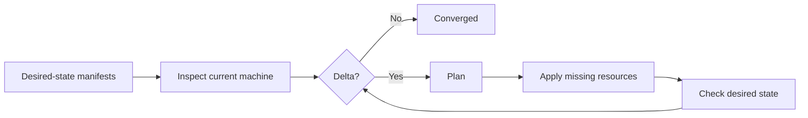
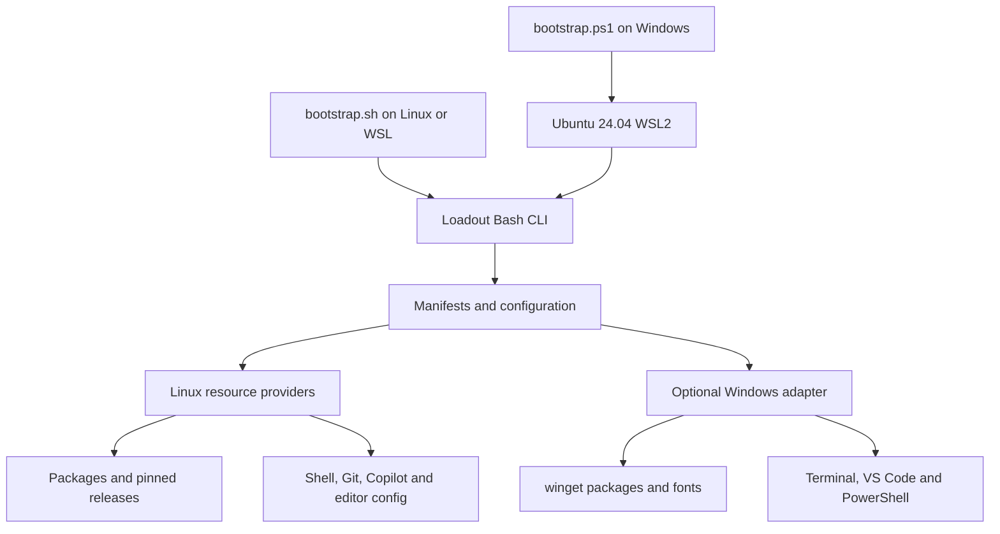

<p align="center">
  
</p>

<p align="center">
  <a href="https://github.com/danielfears/loadout/actions/workflows/ci.yml"></a>
  <a href="LICENSE"></a>
  
  
  
</p>

> **Loadout turns a fresh laptop into a complete Azure DevOps and platform
> engineering workstation, then keeps it converged.**

Clone it, inspect the delta, apply it, and get to work. Loadout installs and
configures the real machine rather than hiding the toolchain inside a
short-lived development container.

```console
$ loadout plan
  [PLAN] install Helm 4.2.3
  [PLAN] install Azure Developer CLI 1.27.1
  [PLAN] install PowerShell module Az 15.1.0
  [PLAN] configure Bash startup

4 changes planned.

$ loadout apply
Loadout applied successfully.

$ loadout check
Machine matches Loadout.
```

## Why Loadout?

Developer workstation setup is usually a mixture of wiki pages, half-remembered
commands, stale install scripts and manual clicking. Loadout treats the
workstation like any other platform:

- **Declarative** desired state lives in versioned manifests.
- **Idempotent** resources inspect before changing anything.
- **Transparent** plans show the exact delta.
- **Verifiable** checks detect drift and return a failing exit code.
- **Portable** installers support Ubuntu 24.04 on ARM64 and AMD64.
- **Cross-environment** orchestration configures Linux directly and Windows
  through a narrow WSL adapter.
- **Secret-safe** configuration contains desired state, never credentials or cached
  authentication.

## Quick start

### Fresh Windows 11 laptop

Clone Loadout anywhere on Windows, open an elevated PowerShell in the
repository, and run:

```powershell
Set-ExecutionPolicy -Scope Process Bypass
.\bootstrap.ps1
```

The Windows entry point:

1. Installs Ubuntu 24.04 under WSL2 when required.
2. Creates the Linux user and enables WSL systemd.
3. Copies Loadout into Linux.
4. Restarts WSL only when its configuration changed.
5. Delegates to the same Linux convergence engine.
6. Configures Windows Terminal, VS Code, PowerShell, Copilot and Nerd Fonts.

### Existing Ubuntu 24.04 or WSL

```bash
git clone https://github.com/danielfears/loadout.git
cd loadout
./bootstrap.sh
```

On native Linux, Windows resources are automatically ignored. In WSL, use
`--skip-windows` when only the Linux side should be managed.

### Install the command without applying

```bash
./install.sh
~/.local/bin/loadout plan
~/.local/bin/loadout apply
```

## Commands

| Command | Purpose |
|---|---|
| `loadout plan` | Show missing, outdated or misconfigured resources without changing managed configuration. |
| `loadout apply` | Apply only the detected delta; asks for confirmation by default. |
| `loadout check` | Verify convergence and exit non-zero when drift exists. |
| `loadout doctor` | Diagnose the platform, prerequisites and authentication. |
| `loadout list` | Summarise the default desired state. |
| `loadout recommend` | Show useful workflow-specific tools that are intentionally optional. |
| `loadout version` | Print the installed Loadout version. |

Common options:

```text
--yes               Apply non-interactively
--skip-windows      Ignore the Windows host adapter
--skip-services     Skip service/group resources in containers
--verbose           Include already-converged resources
--no-colour         Disable ANSI output
```

## The zero-to-hero default

Loadout ships one opinionated Azure DevOps and platform-engineering setup. It
deliberately includes more than a minimal shell.

### Azure delivery and identity

- Azure CLI, Azure Developer CLI (`azd`), Bicep and AzCopy
- Azure DevOps, Resource Graph, Network Manager and Kubernetes extensions
- PowerShell 7 with the complete `Az` 15.1.0 module suite
- `kubelogin` for Microsoft Entra-enabled AKS clusters

### Infrastructure as code and policy

- Terraform through `tfenv`, TFLint and terraform-docs
- Packer, Infracost, Open Policy Agent and Conftest
- Trivy configuration and vulnerability scanning

### Kubernetes and GitOps

- kubectl, Helm 4, Kustomize, k9s and kind
- Flux CLI, stern and kubeconform
- Docker Engine, Buildx and Compose

### Secrets and software supply chain

- SOPS and age
- cosign for signing and verification
- Syft for SBOM generation
- ORAS for OCI artefacts

### CI and repository quality

- GitHub CLI and GitLab CLI
- actionlint, hadolint, ShellCheck, yamllint and pre-commit
- yq, jq, ripgrep, fd, bat and Pandoc

### Developer experience

- NVM-managed Node.js, npm, Corepack and GitHub Copilot CLI
- fzf, zoxide, eza, delta, lazygit and fastfetch
- Bash completion for Loadout commands and options
- VS Code extensions for Terraform, Python, PowerShell and remote development
- Windows Terminal with Cascadia Mono NF and a Dracula colour scheme
- Safe Azure device-code login helpers and a useful startup dashboard

<details>
<summary><strong>Why some tools remain optional</strong></summary>

Run `loadout recommend` to see workflow-specific recommendations. Loadout avoids
installing overlapping workflow tools merely to make the list longer. Argo CD,
Terragrunt, Grype, OpenTofu, Vault, Crossplane and Dagger are valuable when the
target platform actually uses them.

</details>

## How idempotence works



Each resource owns its own inspection and convergence logic:

- APT installs only missing packages.
- Release tools compare reported versions before downloading.
- Downloads use pinned versions and published checksums where upstream
  provides them.
- Git-backed version managers compare exact commit SHAs.
- npm, Azure and PowerShell modules compare installed versions.
- Managed files compare content hashes and preserve timestamped backups.
- Windows packages, extensions, settings and fonts are inspected independently.

Re-running `loadout apply` on a converged machine performs no managed changes.

## Architecture



See [docs/architecture.md](docs/architecture.md) for the resource lifecycle and
[docs/customising.md](docs/customising.md) for changing the desired state.

## Safety boundaries

Loadout does **not**:

- store or migrate passwords, tokens, SSH keys or cloud credentials;
- copy project repositories or personal data;
- run `terraform apply`, deploy cloud resources or change Azure subscriptions;
- authenticate silently on the user's behalf;
- overwrite a managed file without retaining a timestamped backup;
- pretend that a failed install succeeded.

The default configuration deliberately runs Copilot with
`--autopilot --allow-all`. This is visible in configuration and should be removed
when a less permissive default is preferred.

After applying, authenticate explicitly:

```bash
gh auth login
glab auth login
azlogin
azd auth login
copilot
infracost auth login
```

## Customising Loadout

There is one desired state:

- `manifests/` pins packages, versions, modules and extensions.
- `config/` contains safe shell, Git, editor, Copilot and terminal settings.

Edit or fork these files, then run `loadout plan`. Loadout intentionally avoids
runtime profile selection so every invocation has one obvious target state.

## Development

```bash
make check             # ShellCheck, JSON/TSV validation and unit tests
make verify-releases   # Confirm every pinned ARM64/AMD64 download exists
make integration       # Build a clean Ubuntu image and converge it twice
```

The normal CI workflow runs on Linux and Windows. The heavier clean-machine
test is available through `workflow_dispatch`.

## Support

The initial supported target is:

- Ubuntu 24.04 LTS, native or under WSL2
- Linux ARM64 and AMD64
- Windows 11 for the optional host bootstrap and adapter

Other distributions should fail clearly rather than being modified
optimistically.

## Contributing and security

Read [CONTRIBUTING.md](CONTRIBUTING.md) before adding a resource provider or
changing the desired state. Security issues should follow
[SECURITY.md](SECURITY.md), not a public issue.

## Licence

[MIT](LICENSE) - Copyright (c) 2026 Daniel Fears. See
[third-party notices](THIRD_PARTY_NOTICES.md) for the bundled terminal palette.
